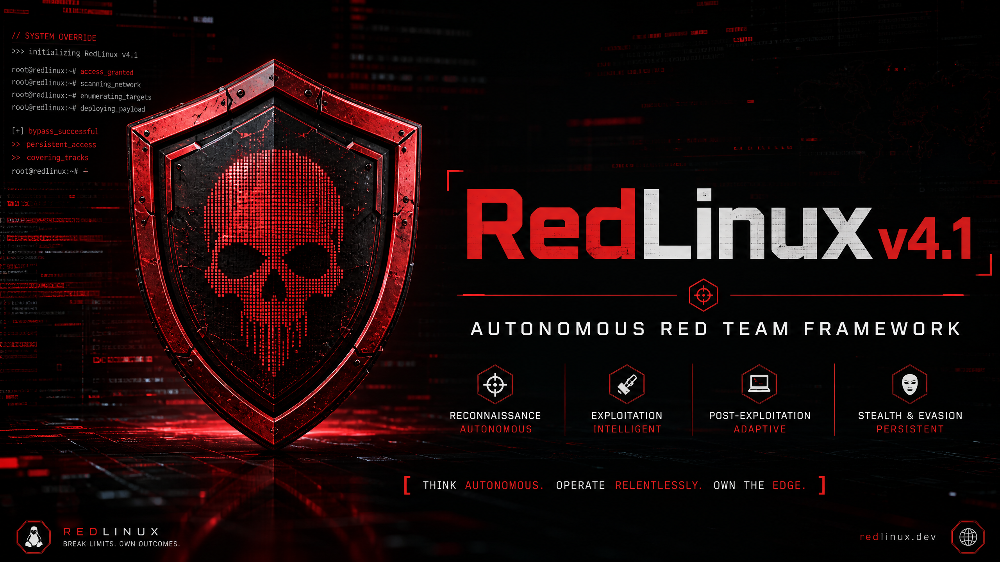

# ⚡️👾 RedLinux — Autonomous Red Team Operations Framework 👾⚡️



## 🛡️ Overview

RedLinux is a cutting-edge, autonomous Red Team Operations Framework designed to streamline and enhance offensive security engagements. Built with a modern full-stack TypeScript architecture, RedLinux provides a sophisticated neural interface for conducting reconnaissance, network infiltration, exploit development, command and control (C2), and data exfiltration.

## 🚀 Key Features

- **Ghost C2 Engine**: Production-grade, asynchronous C2 backbone with E2EE (AES-256-GCM + ChaCha20) and Malleable Profiles (Google Drive, Office365 masquerading).
- **Neural Mesh**: Decentralized, peer-to-peer agent coordination using Gossip protocols and Raft-inspired leader election.
- **Shadow Exfil**: Real-world chunked data exfiltration with support for DNS tunneling, ICMP leakage, and Cryptographically Scattered Steganography.
- **Specter Evasion**: Advanced payload generation with polymorphic source code mutation and anti-VM/anti-sandbox injection.
- **Aether Recon**: Automated OSINT and intelligence gathering across Shodan, Censys, and GreyNoise.
- **Loot Vault**: Secure, encrypted storage for captured credentials, documents, and session logs.

## 📦 Installation

### 1️⃣ Debian / Ubuntu — One-Line Installer ⭐ (Recommended)

```bash
curl -sSL https://raw.githubusercontent.com/masterfrequency/RedLinux/main/scripts/install.sh | sudo bash
```

The installer pulls the **latest release** from GitHub Releases, verifies architecture, and installs the `.deb` for you.

### 2️⃣ Manual `.deb` Install

Grab the latest `redlinux-4.1.0-amd64.deb` from the [Releases page](https://github.com/masterfrequency/RedLinux/releases), then:

```bash
sudo dpkg -i redlinux-4.1.0-amd64.deb
sudo apt-get install -f   # pulls missing deps
```

### 3️⃣ Docker Compose

For quick deployment in isolated environments:

```bash
docker-compose up -d
```

## 🚀 Post-Install — First Boot

```bash
# 1. Configure (JWT_SECRET ≥ 32 chars is required at boot)
sudo cp /opt/redlinux/.env.example /opt/redlinux/.env
sudo nano /opt/redlinux/.env

# 2. Start & enable
sudo systemctl start redlinux
sudo systemctl enable redlinux

# 3. Check it
systemctl status redlinux        # or: journalctl -u redlinux -f
curl http://localhost:3000/      # Supreme UI
```

> The `.deb` does **not** bundle `node_modules` — `postinst` runs `npm install --production` (15 runtime deps only). You need **Node.js ≥ 18** installed first.

## 🧰 Requirements

| Component | Version | Notes |
|-----------|---------|-------|
| Node.js   | ≥ 18    | required by the .deb |
| MySQL     | ≥ 8.0   | DATABASE_URL target |
| Redis     | ≥ 6.0   | bullmq / ioredis |
| nmap      | —       | network scanning modules |
| pnpm      | ≥ 10    | dev only |

## 🛠️ Development Setup

```bash
git clone https://github.com/masterfrequency/RedLinux.git
cd RedLinux
pnpm install
cp .env.example .env          # then fill in secrets
pnpm db:push                  # push drizzle schema to MySQL
pnpm dev                      # tsx watch — HMR dev server
```

### Quality gates

```bash
pnpm check    # tsc --noEmit
pnpm test     # vitest — 7 files / 53 tests
```

### Build the `.deb` from source

```bash
bash scripts/build_deb.sh     # outputs redlinux-4.1.0-amd64.deb
```

## ⚖️ Legal Disclaimer

RedLinux is intended for **authorized security testing and educational purposes only**. Unauthorized use of this framework against systems without explicit permission is illegal and unethical. The developers assume no liability for misuse of this software.

---
⚡️👾 by 🇭🇷 **PhonkAlphabet** 👾⚡️
